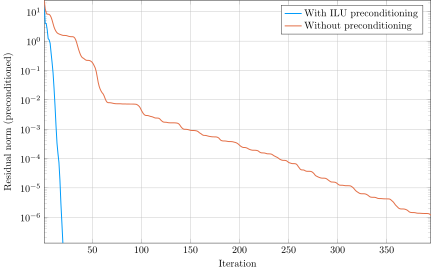

[](https://travis-ci.org/haampie/ILU.jl) [](https://codecov.io/gh/haampie/ILU.jl)

# ILU for SparseMatrixCSC

This package implements the left-looking or Crout version of ILU for the `SparseMatrixCSC` type. The basic algorithm loops roughly as follows:

```
for k = 1 : n
  row = zeros(n); row[k:n] = A[k,k:n]
  col = zeros(n); col[k+1:n] = A[k+1:n,k]

  for i = 1 : k - 1 where L[k,i] != 0
    row -= L[k,i] * U[i,k:n]
  end

  for i = 1 : k - 1 where U[i,k] != 0
    col -= U[i,k] * L[k+1:n,i]
  end

  # Apply a dropping rule in row and col

  U[k,:] = row
  L[:,k] = col / U[k,k]
  L[k,k] = 1
end
```

which means that at each step `k` a complete row and column are computed based on the previous rows and columns:

```
          k
+---+---+---+---+---+---+---+---+
| \ |   | x | x | x | x | x | x |
+---+---+---+---+---+---+---+---+
|   | \ | x | x | x | x | x | x |
+---+---+---+---+---+---+---+---+
|   |   | . | . | . | . | . | . | k
+---+---+---+---+---+---+---+---+
| x | x | . | \ |   |   |   |   |
+---+---+---+---+---+---+---+---+
| x | x | . |   | \ |   |   |   |
+---+---+---+---+---+---+---+---+
| x | x | . |   |   | \ |   |   |
+---+---+---+---+---+---+---+---+
| x | x | . |   |   |   | \ |   |
+---+---+---+---+---+---+---+---+
| x | x | . |   |   |   |   | \ |
+---+---+---+---+---+---+---+---+

col and row are the .'s, updated by the x's.
```

At step `k` we load (part of) a row and column of the matrix `A`, and subtract the previous rows and columns times a scalar (basically a SpMV product). The problem is that our matrix is column-major, so that loading a row is not cheap. Secondly, it makes sense to store the `L` factor column-wise and the `U` factor row-wise (so that we can append columns and rows without data movement), yet we need access to a row of `L` and a column of `U`.

The latter problem can be worked around without expensive searches. It's basically smart bookkeeping: going from step `k` to `k+1` requires updating indices to the next nonzero of each row of `U` after column `k`. If you now store for each column of `U` a list of nonzero indices, this is the moment you can update it. Similarly for the `L` factor.

The matrix `A` can be read row by row as well with the same trick.

## Accumulating a new sparse row or column
Throughout the steps two temporary row and column accumulators are used to store the linear combinations of previous sparse rows and columns. There are two implementations of this accumulator: the `SparseVectorAccumulator` performs insertion in `O(1)`, but stores the indices unordered; therefore a sort is required when appending to the `SparseMatrixCSC`. The `InsertableSparseVector` performs insertion sort, which can be slow, but turns out to be fast in practice. The latter is a result of insertion itself being an `O(1)` operation due to a linked list structure, and the fact that sorted vectors are added, so that the linear scan does not have to restart at each insertion.

The advantage of `SparseVectorAccumulator` over `InsertableSparseVector` is that the former postpones sorting until after dropping, while `InsertableSparseVector` also performs insertion sort on dropped values.

## Example

Using a drop tolerance of `0.01`, we get a reasonable preconditioner with a bit of fill-in.

```julia
> using ILU
> A = sprand(1000, 1000, 5 / 1000) + 10I
> @time fact = crout_ilu(A, τ = 0.001)
  0.005182 seconds (100 allocations: 1.167 MiB)
> vecnorm((fact.L + I) * fact.U.' - A)
0.05610746209883846
> (nnz(fact.L) + nnz(fact.U)) / nnz(A)
3.670773780187284
```

Full LU is obtained when the drop tolerance is `0.0`.

```julia
>  @time fact = crout_ilu(A, τ = 0.)
  0.400229 seconds (116 allocations: 12.167 MiB, 0.41% gc time)
> vecnorm((fact.L + I) * fact.U.' - A)
1.532520861565543e-13
> (nnz(fact.L) + nnz(fact.U)) / nnz(A)
61.66009528503368
```

## Preconditioner
ILU is typically used as preconditioner for iterative methods. For instance

```julia
using IterativeSolvers
using BenchmarkTools
using Plots
using ILU

A = spdiagm((fill(-1.0, 9), fill(2.0, 10), fill(-1.2, 9)), (-1, 0, 1))
Id = speye(10)
A = kron(A, Id) + kron(Id, A)
A = kron(A, Id) + kron(Id, A)

LU = crout_ilu(A, τ = 0.1)

x = rand(1000)
b = A * x

# Bench
with = @benchmark gmres($A, $b, Pl = $LU, restart = 20, maxiter = 1000)
without = @benchmark gmres($A, $b, restart = 20, maxiter = 1000)

# Result
x_with, hist_with = gmres(A, b, Pl = LU, restart = 20, maxiter = 1000, log = true)
x_without, hist_without = gmres(A, b, restart = 20, maxiter = 1000, log = true)

@show norm(b - A * x_with) with
@show norm(b - A * x_without) without

plot(hist_with[:resnorm], yscale = :log10, label = "With ILU preconditioning", xlabel = "Iteration", ylabel = "Residual norm (preconditioned)")
plot!(hist_without[:resnorm], label = "Without preconditioning")
```

Outputs

```julia
norm(b - A * x_with) = 5.187081459171261e-7
with = Trial(2.168 ms)
norm(b - A * x_without) = 1.0806003685676213e-6
without = Trial(16.415 ms)
```

